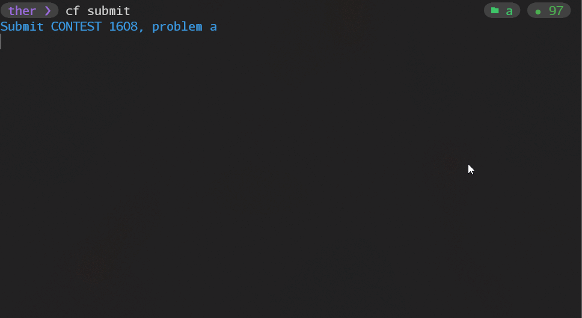
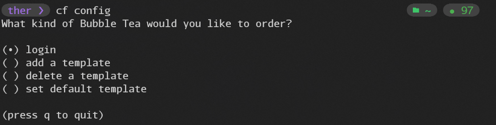

# codeforces-tool

**This is a tool for codeforces.**

## Functions

- Support template✅

  - Add template ✅
  - Remove template✅
  - Set default template✅
  - Generate source files based on templates✅

- Test sample✅

  - Download the problem sample to the local✅
  - Test local samples✅

- Submit problem✅

- Get the status of the question✅

- Get the schedule of the contest✅

Good luck in the codeforces contest!

## How to use

### config

First you should log in and add the template

### contest

- `cf race [contest]`: Initialize the contest and get the sample of the contest.

- `cf test`: Test your code according to the sample of the current problem.

- `cf submit`: Submit the source code of the current problem

- `cf list`: Get a list of current matches and problem status

- `cf skd`: Get the schedule of the contest
